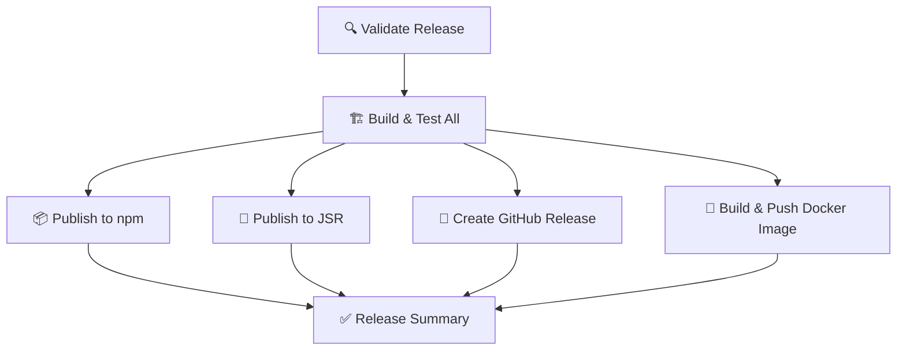

`.github/workflows/release.yml` には `workflow_dispatch` トリガーが設定されており、GitHub UI上から手動でリリース作業を実行できます！

## 🚀 GitHub UI での手動リリース手順

### 1. 事前準備

#### 必要なシークレットの設定確認
```bash
# リポジトリの Settings → Secrets and variables → Actions で確認
- NPM_TOKEN (npm公開用) ✅ 必須
- GITHUB_TOKEN (自動提供) ✅ 自動
# JSR_TOKEN は不要（OIDC認証使用）
```

#### コードの準備
```bash
# ローカルでの最終確認
git checkout main
git pull origin main

# 最新コードでテストが通ることを確認
pnpm run setup
pnpm run test
pnpm run build
```

### 2. GitHub UI での手動実行

#### Step 1: Actions タブに移動
1. GitHubリポジトリページで **「Actions」** タブをクリック
2. 左サイドバーから **「🚀 Release & Deploy」** ワークフローを選択

#### Step 2: 手動実行の開始
1. **「Run workflow」** ボタンをクリック
2. ドロップダウンメニューが表示される

#### Step 3: パラメータの入力

| パラメータ | 説明 | 例 |
|------------|------|-------|
| **Version** | リリースするバージョン（必須） | `1.0.0` または `1.2.0-beta.1` |
| **Mark as pre-release** | プレリリース扱いにするか | `false`（安定版）/ `true`（ベータ版） |
| **Publish to npm** | npmに公開するか | `true`（推奨）/ `false` |
| **Publish to JSR** | JSRに公開するか | `true`（推奨）/ `false` |

#### Step 4: 実行
1. すべてのパラメータを設定
2. **「Run workflow」** ボタンをクリックして実行開始

### 3. 実行例

#### 🎯 安定版リリースの場合
```
Version: 1.0.0
Mark as pre-release: false (チェックなし)
Publish to npm: true (チェック)
Publish to JSR: true (チェック)
```

#### 🧪 ベータ版リリースの場合
```
Version: 1.1.0-beta.1
Mark as pre-release: true (チェック)
Publish to npm: true (チェック)
Publish to JSR: true (チェック)
```

#### 🔒 テスト実行の場合（公開なし）
```
Version: 1.0.0-test
Mark as pre-release: true (チェック)
Publish to npm: false (チェックなし)
Publish to JSR: false (チェックなし)
```

### 4. 実行中の監視

#### ジョブの進行確認
実行後、以下のジョブが順番に実行されます：



#### 各ジョブの役割
- **🔍 Validate**: バージョン形式の検証
- **🏗️ Build & Test**: 全テスト実行、WASMビルド、パッケージ更新
- **📦 npm**: npmレジストリへの公開
- **🦕 JSR**: JSRレジストリへの公開
- **📝 GitHub Release**: GitHubリリースページの作成
- **🐳 Docker**: Docker画像のビルド・公開

### 5. 成功後の確認

#### リリース成果物の確認
```bash
# npm での確認
npm view @nap5/gnrng-id@1.0.0

# JSR での確認
# https://jsr.io/@nap5/gnrng-id

# GitHub Release の確認
# https://github.com/your-repo/releases/tag/v1.0.0

# Docker Image の確認
docker pull ghcr.io/your-repo:1.0.0
```

### 6. タグベースリリース（オプション）

手動実行の代わりに、タグをプッシュして自動実行することも可能：

```bash
# ローカルでタグ作成・プッシュ
git tag v1.0.0
git push origin v1.0.0

# 上記により自動でリリースワークフローが実行される
# （すべての公開オプションが有効になる）
```

### 7. トラブルシューティング

#### よくあるエラー

**npm 401 Unauthorized**
```bash
# NPM_TOKEN の確認・更新が必要
# Settings → Secrets → NPM_TOKEN を再設定
```

**JSR publish failed**
```bash
# OIDC権限を確認
# Actions の permissions: id-token: write が設定されているか確認
```

**WASM build failed**
```bash
# Rust toolchain の問題
# cargo.lock に互換性があるか確認
```

#### ロールバック方法
```bash
# 公開済みパッケージの削除（注意！）
npm unpublish @nap5/gnrng-id@1.0.0 --force

# GitHubリリースの削除
# GitHub UI から該当リリースを削除

# タグの削除
git push --delete origin v1.0.0
git tag -d v1.0.0
```

この手順により、GitHub UI から安全かつ確実にリリース作業を実行できます！✨